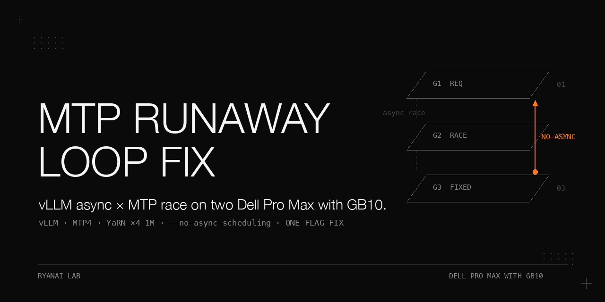

# Runaway repetition with vLLM async scheduling × MTP on two Dell Pro Max with GB10 — the one-flag fix `--no-async-scheduling`

> A tensor-parallel-2 deployment of a Qwen3.8-Flash-Next NVFP4 checkpoint at 1M context (static YaRN ×4, MTP speculative decoding with 4 draft tokens) across two Dell Pro Max with GB10 (head node + worker node, TP2 over RoCE, 200GbE direct link). Under real agentic evaluation the stack entered runaway repetition loops on 3 of 120 questions in config A (A-config rate 1/40); the other three configs are reported separately in Table 1. A four-config single-variable isolation (120 real-scenario questions per config) localized the failure to the async-scheduling flag: the observed pattern is consistent with a vLLM async-scheduling × MTP host/device race in which accepted-token counts bleed between concurrent requests (hypothesis from the A/B contrast, not isolated to source) — matching community reports #53912/#51571 (different stack; upstream repository, fixed version, and excerpt not recorded in the source). The vLLM build in use was observed to run async scheduling whenever MTP was active, so any MTP use in this build inherited the behavior. The fix is one launch flag, `--no-async-scheduling`: 0/120 runaways in this sample, per-run c7a wall clock back from 212–217 s to 48–52 s, and all three v3 wall-clock gates plus all four performance gates passing on the full re-adjudication. The one gate that still fails (c7-agentic-if score) is consistent with a model restraint behavior (extra tool calls) — suspected, not isolated to a model cause; engine/parse/scoring causes are not ruled out.

## Why this matters

Speculative-decoding bugs are easy to miss because they reproduce under real concurrent agentic traffic and stay silent under scripted batch prefill. This cookbook isolates the failure to a single flag and shows how to tell a *runaway loop bug* apart from a *model restraint gap* on the same workload — two failure modes that look alike in the score column but have different root causes and different fixes. The isolation harness, the runaway detector, and the per-question breakdown are the reusable artifacts; the negative result (baseline model unchanged) is itself the answer.

## Hardware and stack

| Item | Value |
|---|---|
| Nodes | Two Dell Pro Max with GB10, TP2: head node + worker node, vLLM in Docker on each |
| Recipe | Community "eugr" cluster recipe; API endpoint `http://<HEAD_IP>:8000/v1` |
| vLLM version / image digest | Not recorded in the permitted sources; vLLM commit, image digest, driver/CUDA, and container/cluster dependency versions are not recorded (the ADR only says "this version of vLLM") |
| Model | Qwen3.8-Flash-Next NVFP4 checkpoint; checkpoint identifier, revision, quantization source, and tokenizer/chat-template config are not recorded; served under an internal alias (omitted) |
| Context flags | `--max-model-len 1000000` plus env `VLLM_ALLOW_LONG_MAX_MODEL_LEN=1` |
| YaRN override | `--hf-overrides` embedding `text_config.rope_parameters`: `rope_type: yarn`, `factor: 4.0`, `original_max_position_embeddings: 262144`, `mrope_interleaved: true`, `mrope_section: [11, 11, 10]`, `rope_theta: 10000000`, `partial_rotary_factor: 0.25` |
| Speculative flag | `--speculative-config '{"method":"mtp","num_speculative_tokens":4,"max_model_len":1000000}'` |
| Async behavior | `async_scheduling` left unset (`None`); the source states vLLM auto-opens async when MTP is used. The parsed config or launch log that would confirm the auto-on default is not recorded |
| The fix | Add `--no-async-scheduling` (one flag) |
| Baseline | DeepSeek V4 Flash Vision-Exp, dspark-style speculation with async also auto-on, same hardware class |

Stack finding baked into the recipe: this vLLM constructs the MTP draft via `ModelConfig(max_model_len=speculative_config.max_model_len, hf_overrides=compose_draft_hf_overrides())`; a dict `hf_overrides` is not passed verbatim to the draft and `max_model_len` defaults to `None`, leaving the draft QSA limit at 262144 (see Pitfalls). The vLLM source version, full traceback, and before/after launch logs for this path are not recorded.

## How to reproduce

> The internal switch script, mode names, hostnames, and the served-model alias are not published. The public abstraction for the stack switch is `switch/stack-mode.sh` in the sibling repo dell-pro-max-gb10-vllm-stack-ab; the commands it wraps are `docker rm -f <head> <worker>` to tear the serving containers down and `docker logs --tail 4000 <head>` to read the negotiated draft-token count from the launch log. The steps below are the procedure as recorded; an exact host-side reproduction requires the same cluster recipe and a checkpoint served under your own alias. Flags are verbatim from the measurement session; engine image, build string, driver/kernel versions, and weights repo are not recorded (see the Hardware and stack table).

1. Bring up the 1M stack on head + worker node with the cluster recipe, the YaRN `--hf-overrides`, `--max-model-len 1000000`, and the MTP spec config carrying `max_model_len: 1000000`. The isolation harness puts the switch script into standby, tears down both serving containers (head + worker), relaunches the head-node and worker-node containers per config, polls `/models` until the engine is up (10 s × 60 cap), and logs the negotiated `num_spec_tokens` from the launch log.
2. Observe intermittent runaway repetition during real agentic evaluation while async scheduling is on (the default with MTP).
3. Run the four-config single-variable isolation (the isolation harness launched four configurations A–D and ran the same 120 questions against each; harness v3). Configs differ by exactly one flag:
   - **A** = MTP4 default (async auto-on, the as-shipped default)
   - **B** = A + `--no-async-scheduling` (the fix)
   - **C** = MTP off in the recorded command; whether this build accepts `num_speculative_tokens: 0` / `--speculative-config null`, and C's actual async state, are not recorded
   - **D** = `num_speculative_tokens: 3` with async default
   Per config: eval-bank probes c7-agentic-if ×3 + c3-tool ×2 (= 120 questions) with thinking off, greedy, parallel 4; then a corruption/loop scanner over the two freshest result dirs; then a synthetic multi-prefill batch reproducer (concurrency 4 × 10 batches).
4. After the root cause: bake `--no-async-scheduling` into the switch script's 1M mode; re-adjudicate the full v3 table (11 categories × 2 runs → c7a × 3 → performance probe K1 → automated compare → restore).
5. Per-question breakdown of the only failing category (c7-agentic-if); `dmesg` check on both nodes.
6. Run `python3 scripts/runaway_detector.py <results.jsonl>` on the recorded chat completions to flag any response with completion > 1500 tokens, or wall > 60 s, or a run of ≥ 20 identical whitespace-separated tokens.

The evaluation bank is our private 11-category eval bank (questions not published); only category codes (c1-kbqa … c10-sre-ops) and item IDs like `C7A-22` appear in this cookbook. Reproducible by readers: the engine-level measurements with the published launch flags (runaway counts, wall-clock, K1 performance probe). Reported only: the private-bank scores (question texts, gold answers, per-question transcripts, grader code, and any bank/grader hashes are not published).

## Results

**Table 1 — Single-variable isolation** (condition: real scenarios c7a×3 + c3×2 = 120 questions per config; thinking off, greedy, parallel 4; harness v3):

| Config | Delta vs A | Runaway loops | c7a wall clock per run | c7a median score |
|---|---|---|---|---|
| A | MTP4, async auto-on (as-shipped default) | **3/120 (= 1/40)** | 212–217 s | 81.7 |
| B | **+ `--no-async-scheduling` (the fix)** | **0/120** | 48–52 s | 91.7 |
| C | MTP off | 0/120 | 58 s | not recorded |
| D | MTP3, async auto-on | **1/120** (that runaway: 8220 tokens / 330 s; the counting scope — single completion vs multi-turn aggregate — is not recorded in the source) | not recorded | not recorded |

- Synthetic multi-prefill reproducer (4-way × 10 batches): **0/40 on all four configs** in this sample — this build did not exhibit community step-size bug #55375 on the reproducer (its PLE path `copy_`s the state index into a contiguous slot table); source/patch evidence for the absence is not recorded.
- Community analogs #53912/#51571 (different stack): async on 16/288 broken, async off 0/288 broken; the upstream repository, fixed version, and accompanying excerpt are not recorded in the source.
- Baseline control: the DeepSeek V4 Flash Vision-Exp baseline (own speculation + async auto-on): **0 runaways in 330 questions** in this sample — the bug was not observed in this sample; it is not established that the baseline model is immune, and its speculation mechanism differs.
- Note on disagreement between sources: config B's c7a median is 91.7 in the isolation run (Table 1) but 81.7 (runs 85.0/80.0/81.7) in the later full-table re-adjudication (Table 2) — same config, different runs; both figures are reported.

**Table 2 — v3 full-table re-adjudication of config B** (candidate = B stack, baseline = DeepSeek V4 Flash Vision-Exp; "perf" rows as recorded; perf units — decode/prefill/six-stream in tok/s, kv in tokens — match the K1 probe in Table 4; input/output length, cold/warm state, timing window, and aggregation rule are not recorded in the source):

| Category / gate | Baseline | Candidate (runs) | Gate | OK |
|---|---|---|---|---|
| c1-kbqa | 83.3 | 93.3 [90.0, 96.67] | ≥73.3 | ✓ |
| c2-longctx (crit) | 87.5 | 100.0 [100.0, 100.0] | ≥82.5 | ✓ |
| c3-tool (crit) | 66.7 | 85.0 [83.33, 86.67] | ≥61.7 | ✓ |
| c4-code | 87.5 | 95.8 [95.83, 95.83] | ≥77.5 | ✓ |
| c5-extract | 92.2 | 91.1 [92.28, 89.83] | ≥82.2 | ✓ |
| c6-vision (crit) | 82.5 | 85.0 [85.0, 85.0] | ≥77.5 | ✓ |
| c7-zhif | 73.3 | 85.0 [86.67, 83.33] | ≥63.3 | ✓ |
| **c7-agentic-if (crit)** | **95.0** | **81.7 [85.0, 80.0, 81.67]** | **≥90.0** | **✗** |
| c8-judgment (crit) | 78.3 | 75.0 [73.33, 76.67] | ≥73.3 | ✓ |
| c9-long-coding (crit) | 100.0 | 98.3 [100.0, 96.53] | ≥95.0 | ✓ |
| c10-sre-ops | 73.3 | 88.3 [86.67, 90.0] | ≥63.3 | ✓ |
| wall c3-tool | 39 s | 46 s (pre-fix async era: 122 s) | ≤1.5× (58.5 s; displayed as 59 s) | ✓ |
| wall c6-vision | 18 s | 17 s (pre-fix async era: 179 s) | ≤1.5× (27 s) | ✓ |
| wall c7-agentic-if | 42 s | 52 s (pre-fix async era: 214 s) | ≤1.5× (63 s) | ✓ |
| perf decode | 32.8 | 51.2 | ≥33 | ✓ |
| perf prefill | 2129 | 3159 | ≥2000 | ✓ |
| perf six (streams) | 82.8 | 87.6 | ≥75 | ✓ |
| perf kv | 1492180 | 3455574 | ≥1.5e+06 | ✓ |
| errors | 0 | 0 | — | — |

Δ own over shared categories = 91.7 − 85.0 = **+6.7** (the own/shared category sets, weighting, and the two totals' computation are not recorded in the source; the +6.7 figure is reported as recorded, not recomputable from this document). Verdict recorded in the source: negative result (baseline unchanged); the fix itself is validated by the three wall-clock gates moving from fail-adjacent to pass. Both nodes' kernel logs post-run: zero GPU Xid; `NVRM NV_ERR_NO_MEMORY 0x51` 5 lines per node with timestamps coinciding with engine startup (the source labels this a known startup memory-probe artifact; dmesg text and version-specific probe-path evidence were not recorded).

**Table 3 — Per-question c7-agentic-if breakdown** (condition: config B post-fix, non-thinking greedy, 3 runs; max 60 = 30 questions × 2):

| Sub-category | Candidate r1/r2/r3 | Baseline r1/r2/r3 |
|---|---|---|
| A Tool Selection | 20/20, 20/20, 18/20 | 20/20, 20/20, 20/20 |
| B Parameter Precision | 3/6, 3/6, 3/6 | 5/6, 5/6, 5/6 |
| C Multi-Step Chains | 6/6, 6/6, 6/6 | 6/6, 6/6, 6/6 |
| D Restraint & Refusal | 2/4, 2/4, 2/4 | 4/4, 4/4, 4/4 |
| E Error Recovery | 20/24, 17/24, 20/24 | 22/24, 22/24, 22/24 |
| **Total** | **51 / 48 / 49** | **57 / 57 / 57** (item-identical across runs) |

Losing items (candidate points, three runs): C7A-09 [2,2,0], C7A-17 [2,0,2], C7A-22 [0,0,0], C7A-26 [0,0,0], C7A-28 [2,1,2] (partial: answer never emits the expected terminal marker), C7A-29 [0,0,0]. Every loss reason is "Extra tool calls made" (except the C7A-28 marker miss). Runaway-style example: C7A-29 turn counts candidate [4, **16**, 4] vs baseline [3,3,3] — one run burned 16 tool-call turns. The listed items account for 6/9/8 points lost across the three runs; each run's total loss (60 − 51 / 60 − 48 / 60 − 49 = 9/12/11) exceeds that by 3 points, so this list is not a complete per-question attribution. These runs' wall clock was 48/67/52 s; the median (52 s) is inside the ≤1.5× (63 s) gate, but one run at 67 s exceeded the per-run cap. Zero engine runaways in these runs — the loop bug and the restraint gap are different failure modes.

**Table 4 — Cost of the fix and the visible symptom** (condition: same two-node engine, K1 speed probe, 1M YaRN configuration):

| Metric | A: MTP4 + async auto-on | B: MTP4 + `--no-async-scheduling` |
|---|---|---|
| single-stream decode (tok/s) | 52.0 | 52.2 |
| cold prefill (tok/s) | 3034 | 3197 |
| six-stream aggregate (tok/s) | 89.4 | 82.1 (-8%) |
| KV pool tokens | 3,441,324 | 3,455,574 |

Baseline DeepSeek V4 Flash Vision-Exp measured 32.8 / 2129 / 82.8 on the same probe, so the fixed configuration is still +59% single-stream and at parity on six streams.

Visible symptom of a runaway response: the completion degenerates into a repeated token string (for example the same word repeated until max_tokens 4096 is exhausted), taking about 200 s at roughly 20 tok/s; a detector that flags completion > 1500 tokens, or > 60 s, or a run of ≥ 20 identical tokens flags the cases recorded as runaway in the isolation set while the multi-prefill reproducer flags none in this sample (0/40 across four configurations). Raw logs and human labels for a full recall count were not recorded.

Full tables with measurement-condition notes: see `docs/results.md`.

## What did not work

- **MTP3 instead of MTP4** (config D): still 1/120 runaway in this sample (8220 tokens / 330 s). The sample is too small to claim a frequency change from 3/120 to 1/120, and the two runaways are not confirmed to be the same race.
- **MTP off** (config C): 0/120 in this MTP-off sample. This sample does not establish that the loop requires MTP beyond this run; whether this build accepts `num_speculative_tokens: 0` / `--speculative-config null` is not recorded. MTP off also disables the speedup entirely.
- **Synthetic multi-prefill reproducer**: 0/40 across all four configs in this sample — the bug did not reproduce on this scripted batch prefill; only real agentic traffic (120 questions/config) exposed it. Other synthetic loads were not tested.
- **Bug-hunt misdirection**: step-size bug #55375 was not observed on the 0/40 reproducer in this build (source/patch evidence not recorded); K/V-cache length was not varied in a controlled test, so it is not established as irrelevant; zero Xid was observed but does not by itself establish GPU health.
- **Cost of the fix**: the decode/6-stream cost is shown in Table 4 above (this fact sheet); the ADR's fuller cost changelog is outside this fact sheet's sources. In-scope evidence shows all four performance gates pass post-fix.

## Pitfalls

Symptom → root cause → fix. Full expansions with how we found each: see `docs/pitfalls.md`.

1. Startup error `QSA sequence length 1000000 exceeds the configured limit 262144` (traceback in `mtp.py`) → vLLM sizes the MTP draft from `speculative_config.max_model_len` (default `None` → 262144) and does not propagate dict `hf_overrides` → set `"max_model_len": 1000000` **inside** `--speculative-config`.
2. Long repeated-output episodes only when MTP is on → async scheduling × MTP host/device race scrambles accepted-token counts between requests → add `--no-async-scheduling`.
3. "But we never enabled async scheduling" → `async_scheduling=None` means auto-on with MTP in this build → always pass the flag explicitly when using MTP.
4. c7-agentic-if still 81.7 vs 95 after the fix → model over-calls tools (Restraint 2/4 vs 4/4), not an engine bug → do not chase in the serving stack.
5. A clean synthetic reproducer → false confidence: 0/40 on the batch reproducer while real scenarios ran 3/120 → validate speculative-decoding bugs on real agentic workloads.

## Files

- `README.md` — this cookbook
- `docs/results.md` — all result tables with measurement-condition notes
- `docs/pitfalls.md` — pitfalls expanded (symptom / root cause / fix / how we found it)
- `docs/make_banner.py` — banner generator (pure PIL; `pip install Pillow`); writes `docs/assets/banner.png` (uses macOS system fonts; see the file header for the font-fallback note)
- `scripts/runaway_detector.py` — stdlib-only JSONL runaway scanner with `--selftest`

## License

Apache-2.0.
